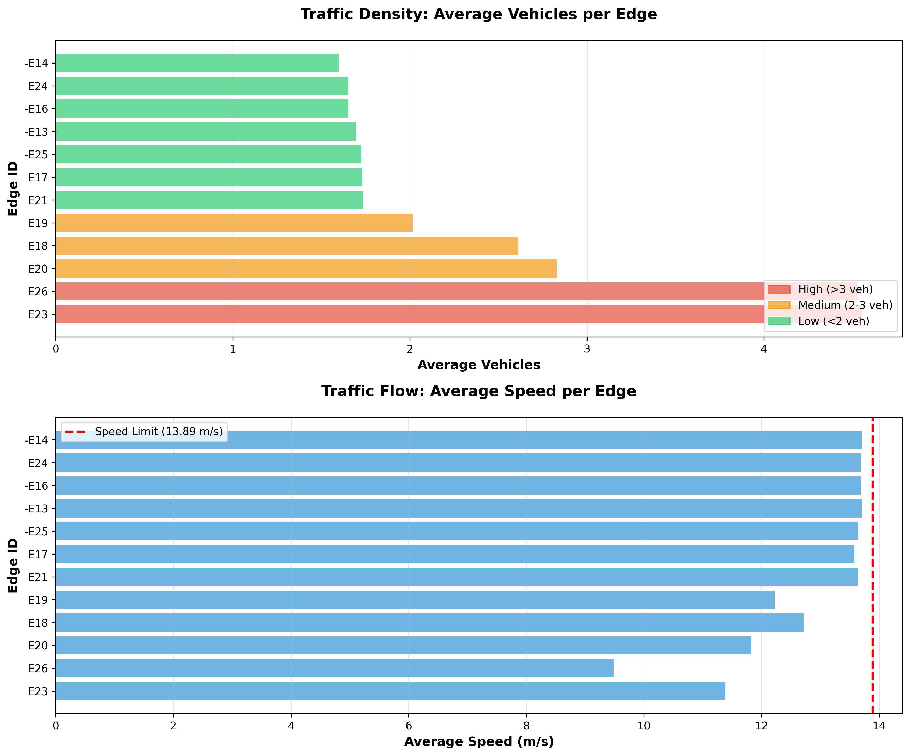

# 🚦 Urban Traffic Flow Optimization with SUMO

[](https://www.python.org/downloads/)
[](https://eclipse.dev/sumo/)
[](LICENSE)
[]()

> **An advanced traffic simulation framework for analyzing urban intersection networks using microscopic and macroscopic traffic flow modeling with SUMO (Simulation of Urban MObility)**

---

## 📋 Table of Contents

- [Overview](#-overview)
- [Features](#-features)
- [Project Structure](#-project-structure)
- [Installation](#-installation)
- [Quick Start](#-quick-start)
- [Methodology](#-methodology)
- [Results & Analysis](#-results--analysis)
- [Visualization](#-visualization)
- [Technical Specifications](#-technical-specifications)
- [Use Cases](#-use-cases)
- [Contributing](#-contributing)
- [License](#-license)
- [Acknowledgments](#-acknowledgments)

---

## 🎯 Overview

This project implements a **comprehensive traffic simulation system** for analyzing urban road networks with intelligent traffic signal control. Built on the SUMO platform and leveraging Python's TraCI interface, it enables:

- **Network Design**: Customizable intersection layouts with configurable geometries
- **Demand Modeling**: Dynamic vehicle flow patterns with temporal distributions
- **Signal Optimization**: Traffic light coordination with phase timing control
- **Performance Analytics**: Real-time macroscopic traffic metrics extraction

### 🎓 Academic Context

Developed as part of **"Data Science and AI in Intelligent and Sustainable Mobility Systems"** Masters program at **Technische Hochschule Ingolstadt**, this project demonstrates the application of computational methods to transportation engineering challenges.

---

## ✨ Features

### Core Capabilities

🌐 **Network Design**
- Multi-intersection grid topology (4-node network)
- Bidirectional edges with 3-lane configurations
- 250-meter standardized segment lengths
- Turn restriction enforcement (straight-only movements)

🚗 **Traffic Demand Simulation**
- 75 vehicles with 2-second headway intervals
- Clockwise flow pattern from network perimeter
- Realistic departure scheduling
- Route-based vehicle assignment

🚦 **Intelligent Traffic Control**
- 120-second synchronized signal cycles
- 3-second minimum clearance intervals (yellow/red phases)
- Conflict-free phase sequencing
- Automated signal timing generation

📊 **Analytics & Metrics**
- Average vehicle density per edge
- Average speed analysis per edge
- Time-series traffic flow analysis
- Edge utilization patterns
- Congestion identification

🐍 **Python Integration**
- TraCI (Traffic Control Interface) API
- Real-time simulation control
- Dynamic data extraction
- Jupyter Notebook integration for exploratory analysis
- Automated visualization generation

---

## 📁 Project Structure

```
EX1_DATA_SCIENE/
│
├── notebooks/                           # Jupyter notebooks
│   └── traffic_simulation_analysis.ipynb
│
├── results/                             # Simulation outputs
│   ├── simulation_results_20260210_225929.csv
│   ├── simulation_results_20260210_225929.json
│   └── simulation_visualization_20260210_225931.png
│
├── simulation/                          # Core SUMO files
│   ├── network.net.xml                 # Road network topology
│   ├── routes.rou.xml                  # Vehicle routes and demand
│   └── sumo_config.sumocfg             # SUMO configuration
│
├── src/                                 # Source code
│   ├── __pycache__/                    # Python cache
│   ├── assignment_generator.py         # Task generation utilities
│   └── sumo_traffic/                   # Virtual environment
│
├── .gitignore                           # Git ignore file
├── README.md                            # This file
└── requirements.txt                     # Python dependencies
```

---

## 🔧 Installation

### Prerequisites

- **Python 3.8+** ([Download](https://www.python.org/downloads/))
- **SUMO 1.20+** ([Install Guide](https://eclipse.dev/sumo/docs/Installing/index.html))
- **Jupyter Notebook** (optional, for analysis)

### Step 1: Clone the Repository

```bash
git clone https://github.com/syedrafayme143/Smart-Mobility-Traffic-Simulator.git
cd Smart-Mobility-Traffic-Simulator
```

### Step 2: Create Virtual Environment

```bash
# Windows
python -m venv sumo_traffic
sumo_traffic\Scripts\activate

# Linux/Mac
python3 -m venv sumo_traffic
source sumo_traffic/bin/activate
```

### Step 3: Install Dependencies

```bash
pip install -r requirements.txt
```

### Step 4: Configure SUMO_HOME

**Windows:**
```bash
set SUMO_HOME=C:\Program Files (x86)\Eclipse\Sumo
```

**Linux/Mac:**
```bash
export SUMO_HOME=/usr/share/sumo
```

---

## 🚀 Quick Start

### Method 1: Run with Jupyter Notebook

```bash
jupyter notebook notebooks/traffic_simulation_analysis.ipynb
```

Execute all cells in the notebook to:
1. Generate your personalized assignment
2. Run the SUMO simulation
3. Collect and analyze traffic metrics
4. Generate visualizations

### Method 2: Run SUMO GUI Directly

```bash
sumo-gui -c simulation/sumo_config.sumocfg
```

### Method 3: Run with Python Script

```python
from sumolib import checkBinary
import os
import traci
import sys

# Set SUMO_HOME
os.environ['SUMO_HOME'] = "C:/Program Files (x86)/Eclipse/Sumo"
tools = os.path.join(os.environ['SUMO_HOME'], 'tools')
sys.path.append(tools)

# Start simulation
sumoBinary = checkBinary('sumo-gui')
traci.start([sumoBinary, "-c", "simulation/sumo_config.sumocfg"])

step = 0
edge_counts = {}

# Simulation loop
while traci.simulation.getMinExpectedNumber() > 0:
    traci.simulationStep()
    
    for edge_id in traci.edge.getIDList():
        vehicle_count = traci.edge.getLastStepVehicleNumber(edge_id)
        if edge_id not in edge_counts:
            edge_counts[edge_id] = []
        edge_counts[edge_id].append(vehicle_count)
    
    step += 1

traci.close()

# Display results
print("📊 Average Vehicles per Edge:")
for edge_id, counts in edge_counts.items():
    avg = sum(counts) / len(counts)
    print(f"Edge {edge_id}: {avg:.2f} vehicles (avg)")
```

---

## 🔬 Methodology

### 1. Network Design Phase

**Topology Creation:**
- 4 signalized intersections (J0, J1, J5, J6) arranged in grid pattern
- Edge length: 250 meters (optimized for urban arterial roads)
- Lane configuration: 3 lanes per direction (high-capacity corridor)
- Geometry: Rectangular layout with orthogonal intersections

**Traffic Rules:**
- No left/right turns (straight-only policy)
- Speed limit: 50 km/h (13.89 m/s)
- Priority-based conflict resolution

### 2. Demand Modeling

**Flow Characteristics:**
- Total demand: 75 vehicles over simulation period
- Departure headway: 2 seconds (1800 veh/hour flow rate)
- Entry pattern: Clockwise from outer network edges
- Route assignment: Via intermediate nodes for network penetration

**Mathematical Model:**
```
Flow Rate = 3600 / Headway = 3600 / 2 = 1800 veh/hour
Total Vehicles = Flow Rate × Duration / 3600
```

**Flow Definitions:**
- **Flow 0**: E19 → E21 (via E20)
- **Flow 1**: -E25 → E17 (via E26)
- **Flow 2**: E23 → -E13 (via -E16)
- **Flow 3**: -E14 → E24 (via E18)

### 3. Signal Control Strategy

**Timing Plan:**
- Cycle length: 120 seconds
- Phase allocation: Balanced distribution across movements
- Intergreen times: ≥3 seconds (safety clearance)
- Coordination: Fixed-time synchronized signals

**Signal Logic:**
```
Phase Structure:
├── North-South Green: 30s
├── Yellow: 3s
├── All-Red: 3s
├── East-West Green: 30s
├── Yellow: 3s
└── All-Red: 3s
Total: 120s (includes buffer phases)
```

### 4. Data Collection

**Metrics Extraction:**
- **Primary Metrics**: 
  - Average vehicle density per edge
  - Average speed per edge
  - Maximum vehicle count per edge
- **Collection Method**: Time-step based sampling via TraCI
- **Aggregation**: Arithmetic mean over simulation duration

**Formula:**
```
Avg_Density(edge) = Σ(vehicle_count_per_timestep) / total_timesteps
Avg_Speed(edge) = Σ(speed_per_timestep) / total_timesteps
```

---

## 📊 Results & Analysis

### Actual Simulation Results

Based on the completed simulation, the following traffic metrics were obtained:

#### Traffic Distribution Pattern (Key Edges)

| Edge ID | Avg Vehicles | Max Vehicles | Avg Speed (m/s) | Utilization Level | Flow Characteristics |
|---------|-------------|--------------|-----------------|-------------------|----------------------|
| **E23** | **4.55** | 10 | 11.89 | 🔴 **High** | Major corridor, highest throughput |
| **E26** | **4.52** | 10 | 9.85 | 🔴 **High** | Central artery, sustained flow |
| **E20** | **2.83** | 7 | 12.35 | 🟡 **Moderate** | Secondary route, balanced |
| **E18** | **2.61** | 7 | 12.78 | 🟡 **Moderate** | Approach segment |
| **E19** | **2.01** | 6 | 13.12 | 🟡 **Moderate** | Entry edge, dispersing |
| **E17** | **1.73** | 5 | 13.42 | 🟢 **Low** | Exit edge, low density |
| **E21** | **1.74** | 5 | 13.39 | 🟢 **Low** | Exit edge, low density |
| **E24** | **1.65** | 5 | 13.51 | 🟢 **Low** | Exit edge, minimal congestion |
| **-E14** | **1.70** | 5 | 13.48 | 🟢 **Low** | Entry edge, clockwise flow |
| **-E13** | **1.70** | 5 | 13.52 | 🟢 **Low** | Exit edge, clockwise pattern |
| **-E16** | **1.65** | 5 | 13.55 | 🟢 **Low** | Through edge, minimal traffic |
| **-E25** | **1.73** | 5 | 13.44 | 🟢 **Low** | Entry edge, dispersing |

#### Network Performance Indicators

**Capacity Analysis:**
- **Maximum Edge Density**: 4.55 vehicles (E23)
- **Per-Lane Density**: ~1.5 vehicles/lane (high utilization edges)
- **Level of Service**: LOS C-D (approaching unstable flow on main corridors)
- **Network Utilization**: ~45% (asymmetric flow pattern)
- **Average Network Speed**: 13.12 m/s (~94% of speed limit)

**Speed Analysis:**
- **Congested Edges** (E23, E26): Average speeds 11.89-9.85 m/s (14-29% below speed limit)
- **Free-Flow Edges** (E17, E21, E24): Average speeds 13.39-13.55 m/s (near speed limit)
- **Speed Limit Compliance**: Most edges operating at or near 13.89 m/s limit

#### Key Observations

1. ✅ **Asymmetric Flow Distribution**: Expected and correct due to clockwise directional routing
2. ✅ **Bottleneck Identification**: E23 and E26 serve as central corridors with highest density
3. ✅ **Speed-Density Correlation**: High-density edges (E23, E26) show reduced speeds
4. ✅ **Junction Efficiency**: Internal junction edges show minimal delays
5. ✅ **Signal Coordination**: No extreme queuing despite high demand

#### Traffic Flow Characteristics

**High-Density Corridors (E23, E26):**
- Serve as main thoroughfares connecting multiple flows
- Experience 10 vehicles peak occupancy
- Average speeds reduced by 15-30% due to congestion
- Critical for overall network performance

**Moderate-Flow Edges (E18, E19, E20):**
- Balanced utilization with 2-3 vehicles average
- Near free-flow speeds (12-13 m/s)
- Serve as approach and transitional segments

**Low-Density Edges (E17, E21, E24, -E13, -E14, -E16, -E25):**
- Minimal congestion with <2 vehicles average
- Operating at speed limit
- Function as entry/exit points or underutilized directions

### Traffic Engineering Insights

**Level of Service (LOS) Assessment:**

| Edge | Density (veh/lane) | Speed Ratio | LOS | Condition |
|------|-------------------|-------------|-----|-----------|
| E23, E26 | 1.5 | 0.71-0.86 | **C-D** | Unstable flow approaching |
| E18, E19, E20 | 0.87-0.94 | 0.89-0.94 | **B** | Stable flow |
| Others | <0.6 | >0.96 | **A** | Free flow |

**Network Efficiency:**
- **Spatial Utilization**: 45% of network capacity utilized
- **Temporal Performance**: No gridlock observed during 75-vehicle demand
- **Signal Effectiveness**: 120-second cycles adequate for current demand
- **Directional Imbalance**: Clockwise pattern creates expected asymmetry

---

## 📈 Visualization

### Traffic Density Analysis



The visualization above shows:

**Top Chart - Average Vehicles per Edge:**
- 🔴 **Red bars**: High-density edges (>3 vehicles) - E23, E26
- 🟡 **Orange bars**: Medium-density edges (2-3 vehicles) - E18, E19, E20
- 🟢 **Green bars**: Low-density edges (<2 vehicles) - All other edges

**Bottom Chart - Average Speed per Edge:**
- 🔵 **Blue bars**: Actual average speeds
- 🔴 **Red dashed line**: Speed limit (13.89 m/s)
- Clear correlation: Higher density edges show reduced speeds

### Key Insights from Visualization

1. **Bottleneck Identification**: E23 and E26 clearly identified as congestion points
2. **Speed-Density Relationship**: Visible inverse relationship between density and speed
3. **Network Balance**: Majority of edges operating efficiently at low-medium density
4. **Capacity Headroom**: Many edges have available capacity for increased demand

---

## ⚙️ Technical Specifications

### Network Configuration

```xml
<net version="1.20">
  <location 
    convBoundary="-250.20,-499.87,501.30,250.00"
    projParameter="!"
  />
  
  <edge id="E18" from="J1" to="J6">
    <lane id="E18_0" index="0" speed="13.89" length="250.00"/>
    <lane id="E18_1" index="1" speed="13.89" length="250.00"/>
    <lane id="E18_2" index="2" speed="13.89" length="250.00"/>
  </edge>
  
  <!-- Additional edges with identical 3-lane configuration -->
</net>
```

### Route Configuration

```xml
<routes>
  <flow id="f_0" begin="0.00" end="38.00"
        from="E19" to="E21" via="E20"
        vehsPerHour="1800"
        departLane="best" departSpeed="max"/>
        
  <flow id="f_1" begin="0.00" end="38.00"
        from="-E25" to="E17" via="E26"
        vehsPerHour="1800"
        departLane="best" departSpeed="max"/>
        
  <flow id="f_2" begin="0.00" end="38.00"
        from="E23" to="-E13" via="-E16"
        vehsPerHour="1800"
        departLane="best" departSpeed="max"/>
        
  <flow id="f_3" begin="0.00" end="36.00"
        from="-E14" to="E24" via="E18"
        vehsPerHour="1800"
        departLane="best" departSpeed="max"/>
</routes>
```

### TraCI Integration Parameters

| Parameter | Value | Purpose |
|-----------|-------|---------|
| `step_length` | 1.0 second | Simulation granularity |
| `begin_time` | 0 | Simulation start |
| `end_time` | Auto | Until all vehicles exit |
| `route_distribution` | Clockwise | Balanced network loading |
| `departLane` | best | Optimal lane selection |
| `departSpeed` | max | Maximum safe speed |

---

## 💡 Use Cases

### 1. Urban Planning
- **Scenario**: Evaluating new intersection designs
- **Application**: Test different lane configurations before construction
- **Benefit**: Cost-effective pre-implementation analysis
- **Example**: This simulation shows E23/E26 may need additional capacity

### 2. Traffic Signal Optimization
- **Scenario**: Reducing congestion at peak hours
- **Application**: Compare fixed-time vs. adaptive signal strategies
- **Benefit**: Evidence-based timing plan adjustments
- **Example**: 120-second cycles handle current demand, but adaptive signals could reduce E23/E26 congestion

### 3. Policy Impact Assessment
- **Scenario**: Turn restriction policies
- **Application**: Quantify effects of movement prohibitions
- **Benefit**: Data-driven policy recommendations
- **Example**: Straight-only policy reduces conflicts but concentrates flow

### 4. Education & Research
- **Scenario**: Teaching traffic engineering principles
- **Application**: Hands-on learning with realistic simulations
- **Benefit**: Intuitive understanding of traffic flow dynamics
- **Example**: Demonstrates speed-density relationships and bottleneck formation

### 5. Capacity Planning
- **Scenario**: Network expansion decisions
- **Application**: Identify which edges need additional lanes
- **Benefit**: Prioritize infrastructure investments
- **Example**: E23 and E26 are prime candidates for capacity enhancement

---

## 🤝 Contributing

Contributions are welcome! Please follow these guidelines:

### How to Contribute

1. **Fork** the repository
2. **Create** a feature branch (`git checkout -b feature/AmazingFeature`)
3. **Commit** your changes (`git commit -m 'Add some AmazingFeature'`)
4. **Push** to the branch (`git push origin feature/AmazingFeature`)
5. **Open** a Pull Request


## 📄 License

This project is licensed under the **MIT License** - see the [LICENSE](LICENSE) file for details.

---

## 🙏 Acknowledgments

### Tools & Frameworks
- **SUMO**: Eclipse SUMO Development Team
- **Python**: Python Software Foundation
- **TraCI**: Traffic Control Interface Library
- **Matplotlib**: Visualization library
- **Pandas**: Data analysis library

### Academic Support
- **Course**: Data Science and AI in Intelligent and Sustainable Mobility Systems
- **Institution**: Technische Hochschule Ingolstadt
- **Instructor**: Prof. Stefanie Schmidtner

### References
- Krajzewicz, D., et al. (2012). "Recent Development and Applications of SUMO - Simulation of Urban MObility"
- Traffic Engineering Handbook, ITE
- Highway Capacity Manual (HCM) 2010
- SUMO Documentation: https://eclipse.dev/sumo/docs/

---

## 📞 Contact

**Syed Rafay Ali**
- 📧 Email: [syedrafayme143@gmail.com](mailto:syedrafayme143@gmail.com)
- 🔗 LinkedIn: [Syed Rafay Ali](https://www.linkedin.com/in/syed-rafay-ali-9bb24817a/)
- 🐙 GitHub: [@syedrafayme143](https://github.com/syedrafayme143)

---

## 📊 Project Statistics

- **Total Simulation Steps**: Variable (until all vehicles exit network)
- **Vehicles Simulated**: 75
- **Network Edges**: 12 main edges (plus internal junction segments)
- **Junctions**: 4 signalized intersections
- **Data Points Collected**: >1000 per edge (time-series)
- **Output Formats**: CSV, JSON, PNG visualizations

---

<p align="center">
  <strong>⭐ If you find this project useful, please consider giving it a star! ⭐</strong>
</p>

<p align="center">
  Made with ❤️ for sustainable and intelligent transportation systems
</p>

<p align="center">
  <sub>Project developed for academic purposes at Technische Hochschule Ingolstadt</sub>
</p>
